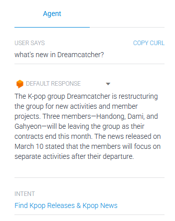
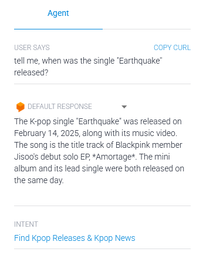
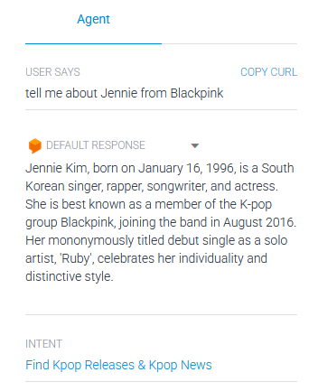

### 🎧 K-pop AI Agent for Dialogflow

This is a personal pet project – an intelligent K-pop AI agent built as a webhook for Dialogflow. It was created specifically for my daughter, a passionate K-pop fan, to simplify her information gathering process for her Telegram channel. This project is powered by a Large Language Model (LLM) and a suite of specialized tools, representing a hands-on exploration into building sophisticated AI agents, integrating APIs, and developing conversational interfaces.

#### 🚀 Features

- Intelligent Conversational Agent: Leverages a powerful LLM to understand and respond to diverse K-pop-related queries.
- Dynamic Tool Calling: Automatically decides which tool to use based on the user's intent:

    - New K-pop Releases: Fetches the latest K-pop music videos from YouTube.
    - General K-pop News: Performs web searches for news, comebacks, artist activities, and more.
    - YouTube Video Q&A: Answers specific questions about provided YouTube video URLs.

- Dialogflow Integration: Connects seamlessly with Dialogflow as a webhook for robust intent management and natural language understanding.
- Built for Scalability: Ready for deployment on cloud platforms like Render.

#### 🛠️ Tech Stack

- Python 3.10+
- Flask & Flask-CORS: For the webhook server.
- Dialogflow (Google Cloud): For NLU and conversational flow management.
- LangChain: Framework for building LLM-powered applications.
- Hugging Face Inference API: Powers the Large Language Model (CohereLabs/c4ai-command-r-v01).
- DuckDuckGo Search API (via LangChain): For general web searches.
- YouTube Data API (v3): For fetching K-pop music videos and performing video QA.
- python-dotenv: For local environment variable management.
- Hosted on Render: For easy deployment of the web service.

#### 📁 Project Structure

```
├── app.py              # Main Flask application, handling Dialogflow webhook requests.
├── kpop_agent.py       # Core AI agent logic, LLM interaction, tool definitions, and tool execution.
├── requirements.txt    # All required Python dependencies for the project.
├── .env                # (Not included!) Local file to securely store API keys and configuration.
└── README.md           # Project overview and instructions.
```

#### ⚠️ Important: Environment Variables

- For security reasons, the .env file is not included in this repository. You must provide your own API keys for the services used.
Create a .env file in the root directory (for local development) or set environment variables directly on your hosting platform (e.g., Render) for:
    - HUGGINGFACEHUB_API_TOKEN: Your Hugging Face API token for LLM access.
    - YOUTUBE_API_KEY: Your Google Cloud / YouTube Data API v3 key.

#### 📡 How It Works

- Dialogflow Interaction: When a user interacts with the Dialogflow agent, Dialogflow detects the intent and extracts relevant information.
- Webhook Trigger: Dialogflow sends a POST request containing the user's query to your Render-hosted webhook endpoint (app.py).
- AI Agent Processing: The app.py receives the request and passes the user's message to the process_dialogflow_request function in kpop_agent.py.
- LLM and Tool Orchestration: The LLM analyzes the query and the available tools (web_search, get_kpop_releases_tool, youtube_video_qa). It then decides whether to answer directly or to call one of the tools.
- Tool Execution: If a tool is called (e.g., for "new kpop releases" or "what's new with BTS?"), the agent executes the corresponding Python function to fetch external data.
- Final Response: The results from the tool (or the LLM's direct answer) are fed back to the LLM, which then forms a concise and helpful fulfillment message, sent back to Dialogflow and ultimately to the user.

#### ✨ Agent demonstration:

<p align="center">
  
  
  
</p>

#### 🧪 Example Dialogflow Setup

- While the agent dynamically uses tools, you'd typically have intents like:
    - Intent Name: Kpop Releases (with training phrases like "show new kpop releases", "latest mvs", "recent comebacks")
        - Fulfillment: Webhook enabled.
    - Intent Name: Kpop News (with training phrases like "what's new with BTS?", "tell me about Aespa's new song", "any news about Blackpink's comeback?")
        - Fulfillment: Webhook enabled.
    - Intent Name: YouTube Video Question (with training phrases like "what is this video about [URL]?", "summarize [URL]")
        - Fulfillment: Webhook enabled.

#### 🔐 Security Notes

- **No API keys** or sensitive credentials are included directly in this repo.
- Always use environment variables (via .env locally, or platform settings on Render) to manage your configurations securely.

#### 📚 Status

📌 **An advanced pet project and prototype in active development**  
I'm continuously learning AI engineering and exploring how to build robust, intelligent conversational agents. This project serves as a dynamic sandbox for experimentation and creativity ✨.

#### 🤖 About Jisoo, the K-pop AI Agent

Jisoo is the name of the AI agent created within this project. She is built on the LangChain framework, leveraging the capabilities of a Hugging Face LLM (CohereLabs/c4ai-command-r-v01). Jisoo's core intelligence lies in her ability to dynamically select and use external tools like web search and the YouTube Data API to answer user queries. Her personality and specialization are meticulously defined through a system prompt, making her an expert in K-pop news and releases.

#### [You can test Jisoo in action here](https://huggingface.co/spaces/HannaHrekova/Agent_for_finding_new_releases)

---

#### 📃 License

MIT License — feel free to fork and experiment, but attribution is appreciated 🙏

#### 🙋‍♀️ Author

This AI agent is developed and maintained by a passionate learner exploring the exciting intersection of AI, conversational agents, and K-pop music technology.

